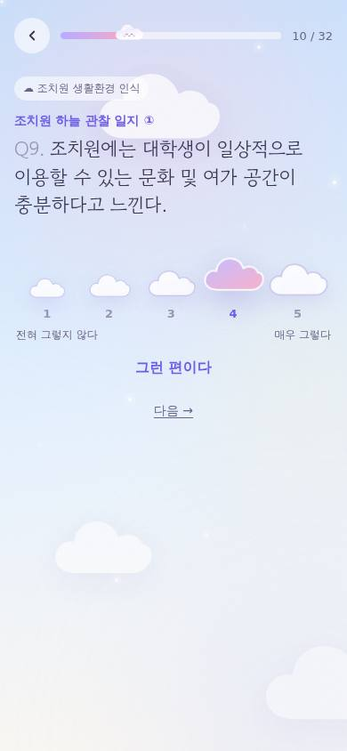
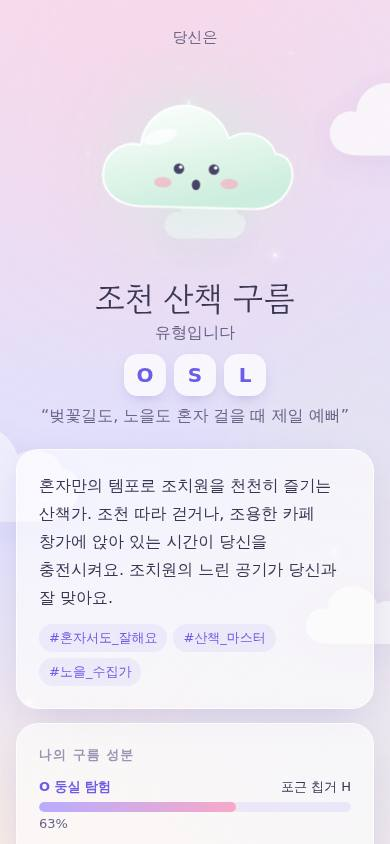
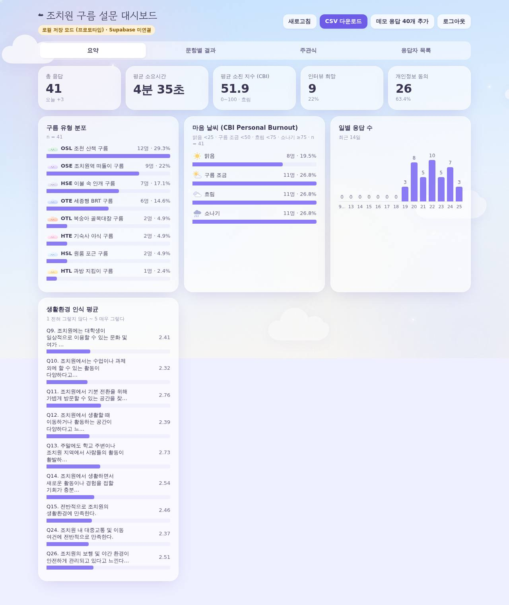

# ☁︎ 나는 어떤 조치원 구름일까?

**조치원 생활환경 및 대학생 소진 경험 조사** (2026 PBL 리빙랩) 온라인 설문 프로토타입.
MBTI 같은 성격유형 테스트 형식으로, 설문을 마치면 8가지 "조치원 구름" 유형과 "마음 날씨"(소진 지수)를 보여줍니다.

| 설문 | 결과 | 관리자 |
|---|---|---|
|  |  |  |

## 구성

- **`/`** 설문. 랜딩 → 개인정보(선택)·동의 → 31개 문항을 한 화면에 하나씩 (조건부 8-1, 28-1, 31-1 포함) → 결과
  - 문항 문구는 원안(09.22) 그대로 두고, 화면 위쪽에 가벼운 도입 문구(kicker)만 덧붙임
  - 단일선택·리커트는 누르면 바로 다음 문항으로 넘어감, 숫자키/Enter 지원
  - 진행 상황은 브라우저에 자동 저장되어 **이어하기** 가능
  - 전송에 실패하면 브라우저에 보관했다가 다음 방문 때 다시 전송
  - 결과 공유 링크 `/?from=OSL` 로 들어오면 "친구는 ○○ 구름이었어요" 배너 표시
- **`/admin`** 관리자 대시보드 (비밀번호 로그인)
  - 요약: 총 응답, 평균 소요시간, 평균 소진 지수, 유형·마음 날씨 분포, 일별 응답, 생활환경 인식 평균
  - 문항별 결과, 주관식(Q29, Q30), 응답자 목록 (연락처 마스킹, 인터뷰 희망자 필터, 응답 상세)
  - CSV 다운로드 (엑셀 호환 UTF-8 BOM)

## 유형 산출 로직 (`lib/cloudTypes.ts`)

| 축 | 의미 | 사용 문항 |
|---|---|---|
| **O / H** | 둥실 탐험 vs 포근 칩거 | Q6, Q7, Q8, Q23 |
| **T / S** | 뭉게 함께 vs 새털 혼자 | Q6, Q23, Q28-1 |
| **L / E** | 조치원 머묾 vs 바깥 여행 | Q9–15 평균, Q5, Q6, Q23 |

- 소진은 **CBI Personal Burnout** 표준 채점(0/25/50/75/100 평균)을 씀
  - 마음 날씨 구간: 맑음 <25 · 구름 조금 <50 · 흐림 <75 · 소나기 ≥75
- 유형 점수는 재미용 지표. 연구 분석에는 CSV의 원자료를 사용
- 임계값은 파일럿 응답을 받은 뒤 분포를 보고 조정 권장

## 개인정보

- 학번·전화번호는 **선택** 입력, 형식 검증 없음
- 입력한 경우 [선택] 개인정보 수집·이용 동의 체크가 필요
- 동의하지 않으면 서버에 저장하지 않음 (`app/api/responses/route.ts`)
- Q31에서 "있다"를 고르면 31-1 연락처 칸에 앞에서 입력한 번호가 미리 채워짐

## 로컬 실행

```bash
npm install
npm run dev          # http://localhost:3000 , 관리자: /admin (기본 비밀번호 chowon2026)
```

- Supabase 환경변수가 없으면 응답은 `.data/responses.json` 에 저장 (프로토타입 모드)
- 관리자 화면의 **데모 응답 40개 추가** 버튼으로 대시보드를 미리 볼 수 있음

## 배포 (Vercel + Supabase 준비되면)

1. Supabase 프로젝트 생성 → SQL Editor에서 `supabase/schema.sql` 실행
   - RLS를 켜고 정책은 만들지 않음 → 서버만 접근 가능
2. Vercel에 이 저장소 Import → 환경변수 설정 (`.env.example` 참고)
   - `SUPABASE_URL`, `SUPABASE_SERVICE_ROLE_KEY`
   - `ADMIN_PASSWORD` (**반드시 변경**)
3. 배포 후 `/admin` 배지가 "Supabase 연결됨"인지 확인

> ⚠️ Vercel은 파일 시스템이 영구 저장되지 않으므로 Supabase 없이 배포하면 응답이 사라집니다.

## 파일 구조

```
app/                  페이지 & API 라우트 (Next.js App Router)
components/Survey.tsx 설문 흐름 전체
components/ResultView.tsx 결과 화면
components/AdminDashboard.tsx 관리자 대시보드
components/Art.tsx, Sky.tsx 구름 캐릭터·하늘 애니메이션 (SVG/CSS)
lib/questions.ts      문항 정의 (문항 수정은 여기서)
lib/cloudTypes.ts     8가지 유형 설명·채점 로직
lib/store.ts          저장소 (Supabase ↔ 로컬 파일)
supabase/schema.sql   DB 스키마
```
